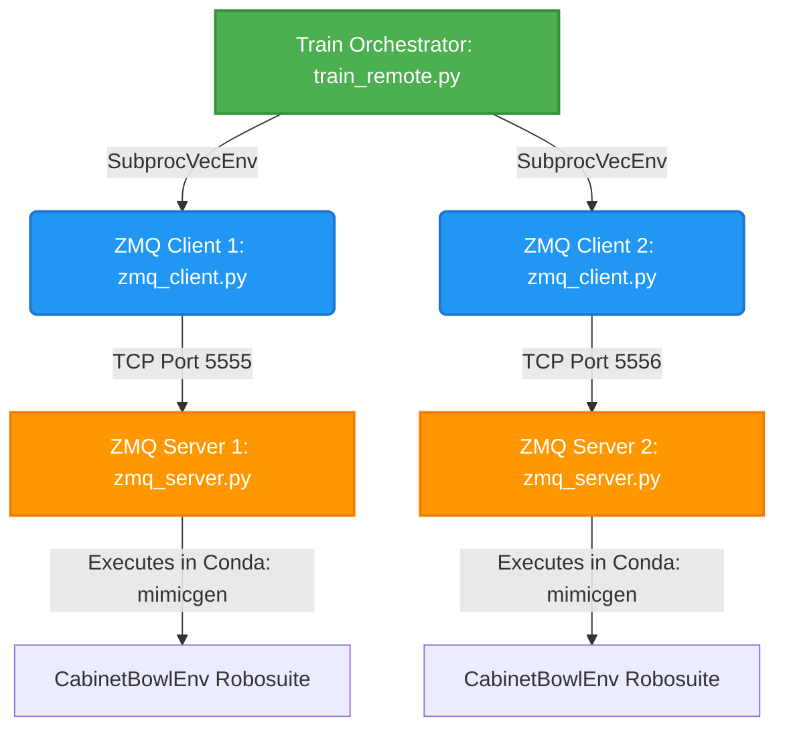

# LeRobot & Robosuite DSRL Training Integration Stack

This directory contains the production-grade, isolated **IPC (Inter-Process Communication) Bridge** and training integration pipeline that combines the **Robosuite MimicGen Environment** (legacy Python 3.8/Gym) with **LeRobot and DSRL (Denoising Stabilized Reinforcement Learning)** (modern Python 3.12/PyTorch/Gymnasium).

---

## 🏗️ Architecture Overview

Due to fundamental versioning conflicts between dependency graphs (legacy Robosuite requires older Python and PyOpenGL versions, while LeRobot and DSRL require modern PyTorch and Python 3.12), we designed a **decoupled Client-Server Architecture** operating over isolated Conda environments:



---

## 🎛️ Core Stack Components

### 1. The IPC Server (`zmq_server.py`)
Runs inside the `mimicgen` Conda environment. It initializes the `CabinetBowlEnv` using the `JOINT_POSITION` controller (8 dimensions: 7 joints + 1 gripper), renders high-resolution camera feeds (`480x640`), wraps it with legacy gym interfaces, and serializes message transactions over TCP sockets.

```python
# Mapped Robosuite Environment to JOINT_POSITION for 8D action space
from robosuite.controllers import load_controller_config
controller_config = load_controller_config(default_controller="JOINT_POSITION")

env = suite.make(
    "CabinetBowlEnv",
    robots="Panda",
    controller_configs=controller_config,
    has_renderer=False,
    has_offscreen_renderer=True,
    use_camera_obs=True,
    camera_names=["topview_custom", "up_sideview", "robot0_eye_in_hand"],
    camera_heights=480,
    camera_widths=640,
    reward_shaping=True,
    control_freq=20,
)
```

### 2. The IPC Client Proxy (`zmq_client.py`)
Runs inside the `lerobot` Conda environment. It serves as a Gymnasium-compliant remote environment proxy, dynamically spawning servers in isolated Conda subprocesses on distinct TCP ports and translating serialized pickle transactions seamlessly.

```python
class ZMQRemoteEnv(gym.Env):
    def __init__(self, port, act_steps, max_episode_steps):
        # Spawns server dynamically inside isolated Conda env
        cmd = f'bash -c "source /opt/miniconda3/bin/activate mimicgen && python {server_path} --port {port} --act_steps {act_steps} --max_episode_steps {max_episode_steps}"'
        self.proc = subprocess.Popen(cmd, shell=True)
        
        self.context = zmq.Context()
        self.socket = self.context.socket(zmq.REQ)
        self.socket.connect(f"tcp://127.0.0.1:{port}")
```

### 3. Environment Wrappers (`env_wrapper.py`)
Contains the wrappers mapping the raw Robosuite states into standard LeRobot formats and matching the RL agent's observation/action space expectations:
* **`LerobotBaseEnvWrapper`**: Translates quaternions to Euler angles, formats camera keys (`observation.images.wrist`, `left`, `right`), and sets up observations.
* **`LerobotActionChunkWrapper`**: Groups standard env steps into `act_steps` chunks, reshaping incoming actions into sequential executing arrays.
* **`LerobotDiffusionPolicyEnvWrapper`**: Wraps vectorized environments, formats states to Stable-Baselines3 flat state formats, and handles terminal observation dictionary-to-state conversions during env auto-resets:

```python
def step_wait(self):
    dict_obs_batch, rewards, dones, infos = self.venv.step_wait()
    
    # Align terminal_observation dictionary format with SB3 flat state expectation
    for i in range(len(infos)):
        if "terminal_observation" in infos[i]:
            term_obs = infos[i]["terminal_observation"]
            if isinstance(term_obs, dict) and "observation.state" in term_obs:
                infos[i]["terminal_observation"] = term_obs["observation.state"]

    self._update_queues(dict_obs_batch)
    rl_obs = dict_obs_batch["observation.state"]
    return rl_obs, rewards, dones, infos
```

### 4. Policy Wrapper (`policy_wrapper.py`)
Bypasses image feature deques to feed cameras directly. It resolves the LeRobot 16-step UNet model horizon mismatch against DSRL's 8-step noise perturbation space by overlaying the 8-step noise onto the specific index slice window:

```python
# Build full horizon noise expected by LeRobot's DiffusionModel
B = initial_noise.shape[0]
horizon = self.base_policy.config.horizon  # 16
action_dim = self.base_policy.config.output_features["action"].shape[0]  # 8
n_obs_steps = self.base_policy.config.n_obs_steps  # 2

full_noise = torch.randn((B, horizon, action_dim), dtype=initial_noise.dtype, device=initial_noise.device)

# Overlay DSRL perturbed noise onto the n_action_steps window index slice [1:9]
start = n_obs_steps - 1
end = start + self.base_policy.config.n_action_steps
full_noise[:, start:end] = initial_noise
```

### 5. Training Orchestration (`train_remote.py`)
Bootstraps training by vectorizing isolated clients inside `SubprocVecEnv` across available CPU threads and auto-aligning configuration fields dynamically from the loaded model weights:

```python
# Auto-align training configs dynamically with checkpoint specifications
policy_act_dim = base_policy_wrapper.base_policy.config.output_features["action"].shape[0]
policy_act_steps = getattr(base_policy_wrapper.base_policy.config, "n_action_steps", 8)
cfg.action_dim = policy_act_dim
cfg.act_steps = policy_act_steps
```

---

## 🚀 Running Training

Launch training natively inside the `lerobot` Conda environment:

```bash
conda activate lerobot
python train_remote.py algorithm=dsrl_sac use_wandb=False
```

The script will automatically spawn 4 parallel ZMQ server processes (on ports `5555` to `5558`), boot up isolated Mujoco simulations in EGL headless mode, auto-align configuration parameters, and run Stable-Baselines3 SAC denoising optimization!
